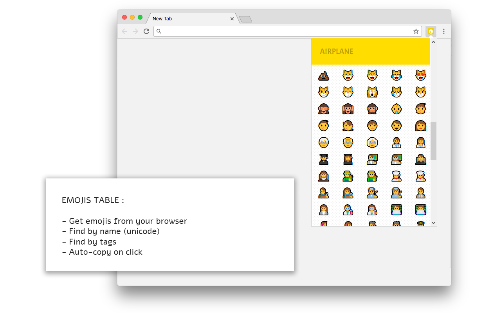

# emojis-table
Get the right emojis from your browser in any tab!

Available here [Firefox Add-ons]() | [Chrome Web Store]().

## Build
Simply clone the repo, ``cd`` in then run ``sh ./dist.sh``.
*Dependencies : you'll need the `zip` command installed in your system.*